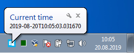

Go-Notifier
===========

`go-notifier` is a gui application intended for showing periodic notification received from another service.

Example
-------

```bash

# start event generator
$> python3 server.py &

# start notification listener
$> go-notifier localhost:9999 icon.ico
```




Message format
--------------

Current socket transport implementation uses `\n`-separated single-line json message (see `server.py`):
```
{"tooltip":"tip","title":"title","info":"info"}\n
```

```json
{
  "tooltip": "program title",
  "title": "popup header",
  "info": "popup text"
}
```

Command-line arguments
----------------------

```sh
go-notifier [address] [icon]
--address value  tcp address for socket server (default: "localhost:9998")
--icon value     notification icon path (default: "icon.ico")

```

Licensing
---------

This software is issued under [GPLv3](LICENSE) license because of using [github.com/esiqveland/notify](github.com/esiqveland/notify) library under Linux. However, Windows version does not use it and could be licensed under MIT/BSD.
